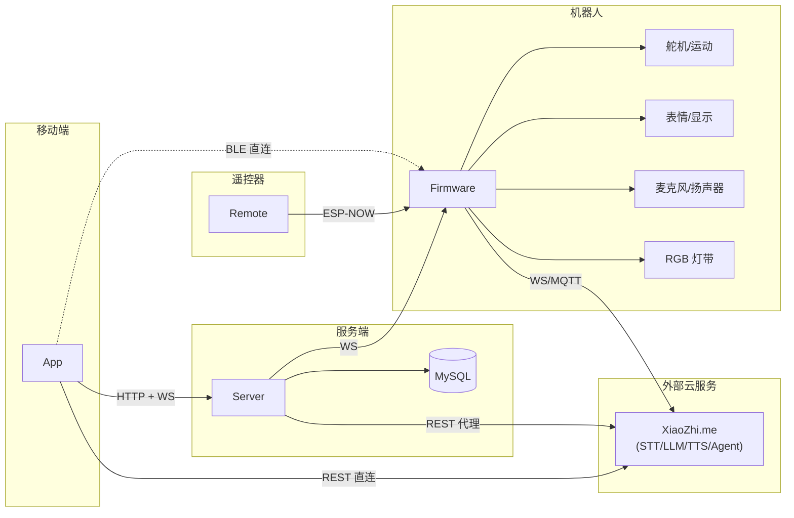

# StackChan 系统总览

## 1. StackChan 是什么系统

StackChan 是一套面向桌面 AI 机器人的软硬件全栈系统：

- **硬件端**：以 M5Stack CoreS3 为核心的机器人本体，带双麦克风、扬声器、摄像头、双轴舵机、RGB 灯带、触摸屏、IMU、NFC、电池管理。
- **固件端**：ESP-IDF 工程，运行两套运行时——
  - **Mooncake UI 运行时**：App 启动器、Avatar 远程表情、Dance、App Center、设置等。
  - **XiaoZhi AI 运行时**：基于 `xiaozhi-esp32` 子模块，负责离线唤醒、语音对话、云端 STT/LLM/TTS、MCP 工具调用。
- **服务端**：GoFrame 写的管理/中继后端，连接 App 与 Firmware，代理 XiaoZhi 云平台的部分管理 API。
- **移动端**：Flutter 跨平台 App，连接 Server 与 Firmware（BLE/网络），完成绑定、控制、配置、历史记录查看。
- **遥控器**：独立的 ESP-IDF 遥控器，通过 ESP-NOW 广播控制机器人头部动作。

---

## 2. 系统组成

| Component | Runtime | Technology | 核心职责 |
|---|---|---|---|
| **Firmware** | ESP32-S3（CoreS3） | ESP-IDF 5.5+ / C++ / LVGL / Mooncake / XiaoZhi-esp32 | 硬件抽象、机器人运动/表情/声音、AI 语音交互、网络/蓝牙/ESP-NOW、OTA |
| **Server** | 服务器/容器 | Go 1.26 / GoFrame 2.10 / MySQL / WebSocket | 用户/设备管理、社区/舞蹈/App 商店、WebSocket 实时中继、XiaoZhi 代理 |
| **App** | iOS / Android | Flutter / Dart / GetX / Dio / flutter_blue_plus | 设备绑定、远程控制 Avatar/动作/摄像头、AI Agent 配置、聊天历史 |
| **Remote** | ESP32 遥控器 | ESP-IDF / M5Unified / ESP-NOW / LVGL 8 | 通过摇杆/IMU 发送头部运动指令 |

---

## 3. 系统架构图

---

## 4. 各端职责边界

### Firmware

必须由 Firmware 完成的事情：

- 舵机运动控制、表情渲染、LED 控制、音频采集与播放。
- 离线语音唤醒（ESP-SR）。
- 与 XiaoZhi 云平台建立实时语音通道（WebSocket 或 MQTT+UDP）。
- 通过 ESP-NOW 接收遥控器动作指令。
- 通过 BLE 接收 App 的 WiFi 配置、绑定握手、本地点播数据。
- 通过 WebSocket 接收 Server/App 的远程控制（表情、动作、视频、音频、通话、舞蹈）。
- OTA 固件/资源升级。
- 设备端 MCP 工具注册与执行（头部角度、LED、提醒等）。

Firmware 不直接处理的事情：

- 用户账号/社交关系/社区内容存储（由 Server + MySQL 处理）。
- LLM 推理本身（由 XiaoZhi 云或自托管服务器处理）。

### Server

必须由 Server 完成的事情：

- App 用户注册/登录（JWT）。
- 设备 MAC 注册与绑定。
- 社区内容：Post、Pano、Dance、Friend、App Store。
- 文件上传/下载。
- **WebSocket 中继**：把 App 的指令按 MAC 转发给对应 Firmware，把 Firmware 的摄像头/音频帧转发给订阅的 App。
- 向 XiaoZhi 云平台换取 Token、License、Agent 配置。

Server 不做的事情：

- 不跑 STT/LLM/TTS（本仓库版本没有本地 AI 推理）。
- 不直接控制硬件。

### App

App 是**配置工具 + 远程控制器 + 内容客户端**：

- 通过 BLE 完成首次配网/绑定/握手。
- 通过 Server REST 完成用户登录、设备绑定、社区内容、文件上传。
- 通过 Server WebSocket 远程控制设备（表情、动作、摄像头、音频、通话、舞蹈）。
- 通过 BLE 直接进行本地点播/舞蹈（无需登录/Server）。
- 直连 XiaoZhi.me 配置 AI Agent、查看聊天历史。

### Remote

Remote 是**纯发送端遥控器**：

- 仅通过 ESP-NOW 向 Firmware 发送 8 字节动作包。
- 不连接 Server、App 或互联网。
- 不接收 Firmware 状态回传。

---

## 5. 系统运行依赖

| 场景 | Firmware | Server | App | Remote | 互联网 |
|---|---|---|---|---|---|
| 基础启动 + Mooncake UI | 必须 | 不需要 | 不需要 | 不需要 | 不需要 |
| AI 语音对话 | 必须 | 不需要 | 不需要 | 不需要 | 需要（XiaoZhi 云） |
| App 远程控制（Avatar/摄像头/动作） | 必须 | 必须 | 必须 | 不需要 | 通常需要 |
| App BLE 配网/本地点播 | 必须 | 不需要 | 必须 | 不需要 | 不需要 |
| Remote 摇杆控制 | 必须 | 不需要 | 不需要 | 必须 | 不需要 |
| 社区/聊天历史/Agent 配置 | Firmware 不需要在线 | 部分需要 | 必须 | 不需要 | 需要（XiaoZhi 云） |
| OTA 升级 | 必须 | 可选 | 可选 | 不需要 | 需要（OTA URL） |

> **关键结论**：Server 不是 AI 语音对话的必经路径；语音数据直接从 Firmware 到 XiaoZhi 云。Server 主要承担 App 与 Firmware 之间的管理面与中继面。

---

## 6. 关键运行时切换

Firmware 存在两个主要运行模式：

1. **Mooncake 应用模式**：`firmware/main/main.cpp` 启动后加载多个 `App*`（Launcher、AI Agent、Avatar、Dance 等），用户通过 Launcher 切换。关闭应用时通过 `requestWarmReboot(appIndex)` 热重启到目标应用。
2. **XiaoZhi AI 模式**：当 `startAiAgentOnBoot` 为真或用户打开“AI.AGENT”应用时，Firmware 会调用 `GetHAL().startXiaozhi()`，进入 `xiaozhi-esp32` 的 `Application::Run()` 主循环，通常不再返回 Mooncake。

这两个模式共享底层 HAL（显示、舵机、音频、网络），但业务入口完全不同。二次开发时必须先确认目标运行在哪个模式下。
