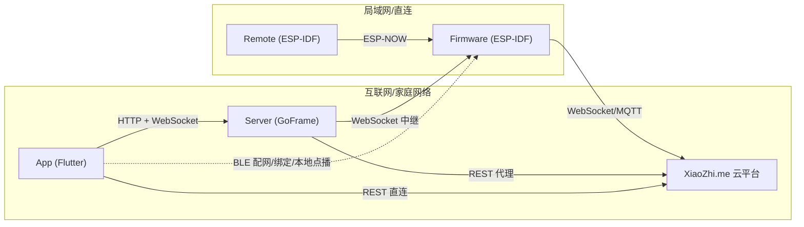

> 该文档描述历史方案、历史快照或早期探索，不代表当前实现。
> 当前方向请参考 docs/README.md 和 docs/architecture.md。

# StackChan AI 二次开发知识库

本文档目录是后续 AI Agent 对 StackChan 进行二次开发时的**入口地图**，目标是让新的 AI 在没有通读仓库的情况下，快速判断：

> “我要改的功能属于哪一端、哪个模块、从哪个文件入手、会影响哪些其他模块。”

---

## StackChan 是什么

StackChan 是 M5Stack 与社区共创的桌面 AI 机器人，基于 **M5Stack CoreS3（ESP32-S3）**。系统由四个可独立演进端组成：

- **Firmware**：运行在机器人本体的 ESP-IDF 固件，负责硬件驱动、UI、运动、AI 语音交互。
- **Server**：GoFrame 后端，负责设备/用户管理、社区内容、WebSocket 实时中继。
- **App**：Flutter 移动客户端，负责设备绑定、远程控制、AI Agent 配置、聊天历史。
- **Remote**：ESP-IDF 遥控器固件，通过 ESP-NOW 直接控制机器人头部动作。

---

## 四端关系速览

---

## 文档索引

| 需求 | 先看哪篇 |
|---|---|
| 整体架构、各端职责、运行依赖 | [`system-overview.md`](system-overview.md) |
| 仓库目录、技术栈、构建入口 | [`repository-structure.md`](repository-structure.md) |
| 模块划分与依赖关系 | [`module-map.md`](module-map.md) |
| 跨端协议、消息格式、通信矩阵 | [`protocols.md`](protocols.md) |
| 关键业务流程的完整调用链 | [`end-to-end-flows.md`](end-to-end-flows.md) |
| 最重要的类/函数/全局状态 | [`core-symbols.md`](core-symbols.md) |
| 二次开发入口（LLM、动作、表情、Command 等） | [`extension-guide.md`](extension-guide.md) |
| 配置项、密钥、项目级/用户级配置 | [`configuration.md`](configuration.md) |

---

## 使用约定

1. **源码是真实来源**。本文档给出入口和关系，实际修改前务必重新验证当前源码。
2. 文档中出现 `⚠️ 待确认` 表示该结论无法从当前代码 100% 确认，需要进一步检查。
3. 修改跨端协议、模块边界、核心数据结构后，应同步回来看这些文档是否过期。
