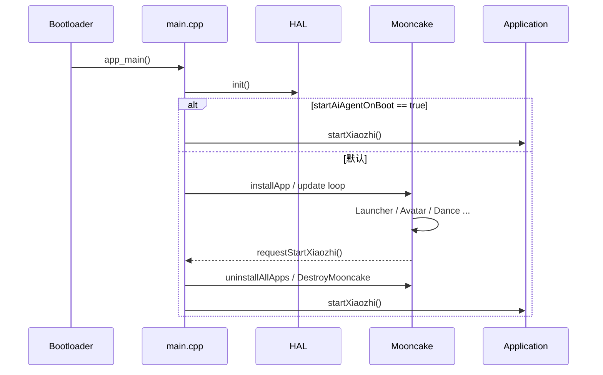
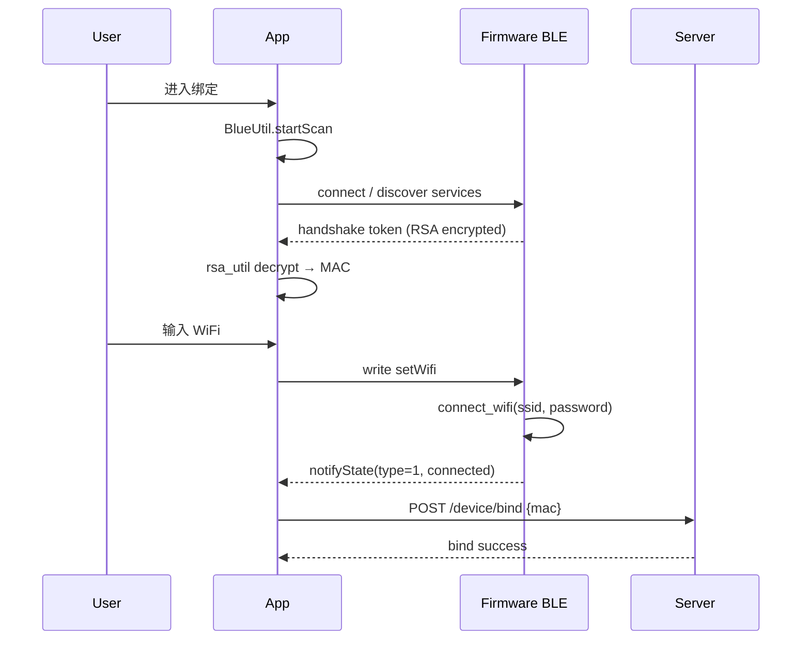
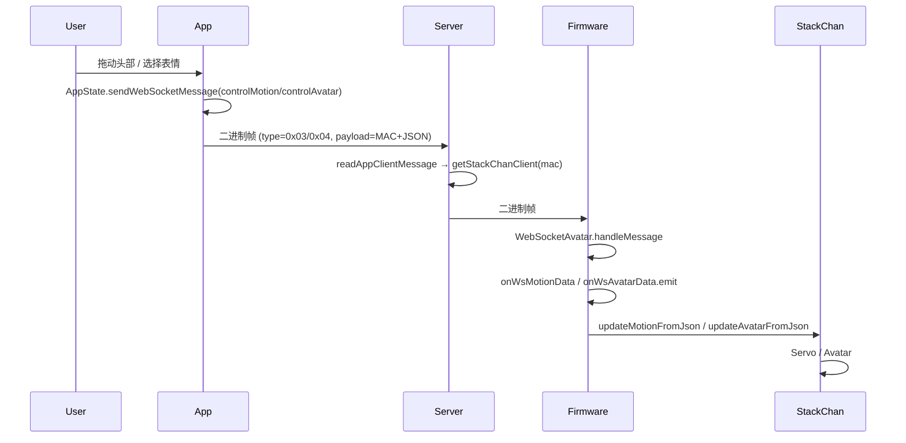
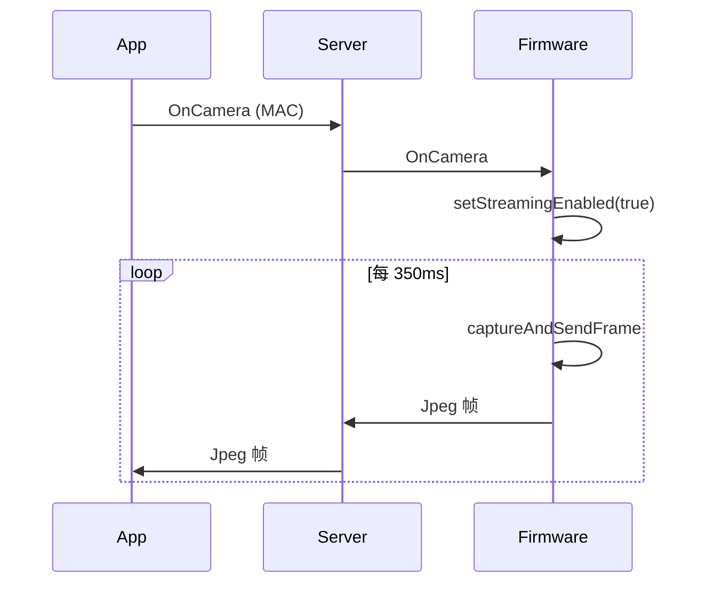
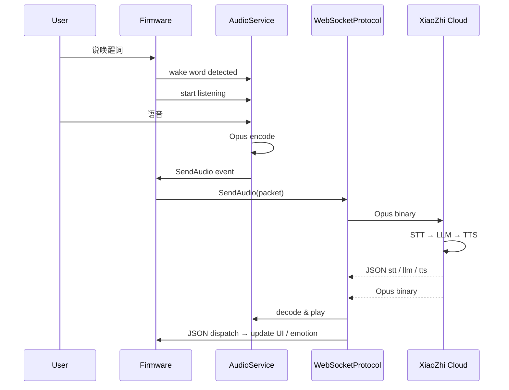
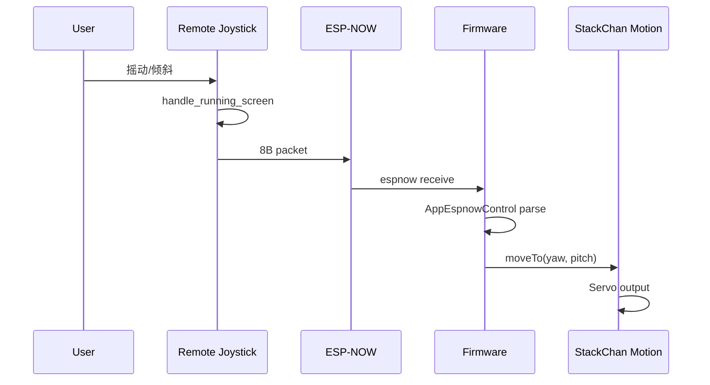

> 该文档描述历史方案、历史快照或早期探索，不代表当前实现。
> 当前方向请参考 docs/README.md 和 docs/architecture.md。

# 端到端关键流程

> 只记录源码中真实存在、且对二次开发有定位意义的完整流程。每个流程追踪到最终执行点。

---

## 1. 固件启动与运行模式切换

### 1.1 启动入口

```text
firmware/main/main.cpp
    app_main()
    ├── GetHAL().init()                 # HAL / 板级 / 网络初始化
    ├── 判断 skip_mooncake:
    │     GetHAL().getXiaozhiConfig().startAiAgentOnBoot
    │     && GetHAL().getWarmRebootTarget() < 0
    │   为真 → 跳过 Mooncake，直接进入 XiaoZhi
    └── 否则运行 Mooncake App 框架
```

### 1.2 Mooncake 模式

```text
main.cpp
    GetMooncake().installApp(...)       # 安装 Launcher / AI Agent / Avatar / Dance 等
    while(1) {
        GetMooncake().update();         # 驱动所有 App 生命周期
        if (GetHAL().isXiaozhiStartRequested()) break;
    }
    GetMooncake().uninstallAllApps();
    DestroyMooncake();
    GetHAL().startXiaozhi();            # 不返回
```

### 1.3 XiaoZhi AI 模式

```text
firmware/xiaozhi-esp32/main/application.cc
    Application::Initialize()
    ├── 初始化 Display
    ├── audio_service_.Initialize(codec)
    ├── audio_service_.Start()
    ├── 注册 AudioServiceCallbacks（唤醒词、VAD、发送队列）
    ├── McpServer::GetInstance().AddCommonTools()
    ├── McpServer::GetInstance().AddUserOnlyTools()
    └── board.StartNetwork()

    Application::Run()
    └── xEventGroupWaitBits 循环处理事件:
        ├── MAIN_EVENT_NETWORK_CONNECTED → ActivationTask() → OTA/激活/获取后端配置
        ├── MAIN_EVENT_SEND_AUDIO        → 从队列取出 Opus 包 → Protocol::SendAudio()
        ├── MAIN_EVENT_WAKE_WORD_DETECTED → 进入 listening
        ├── MAIN_EVENT_TOGGLE_CHAT       → 切换对话状态
        └── MAIN_EVENT_CLOCK_TICK        → 更新状态栏
```

### 1.4 模式切换触发点

| 触发条件 | 文件/函数 | 行为 |
|---|---|---|
| 开机 `startAiAgentOnBoot=true` | `firmware/main/main.cpp:30` | 跳过 Mooncake，直接进 XiaoZhi |
| Launcher 点击 AI.AGENT | `firmware/main/apps/app_ai_agent/app_ai_agent.cpp` | 调用 `GetHAL().requestStartXiaozhi()` |
| Avatar/Dance 等 App 关闭 | 对应 `onClose()` | `GetHAL().requestWarmReboot(appIndex)` |

> ⚠️ XiaoZhi 模式通常不返回 Mooncake；需要重启或热重启才能切回。



---

## 2. App BLE 配网与设备绑定

### 2.1 流程总览

```text
App 用户进入「绑定设备」
    ↓
BlueUtil.startScan() → 过滤 service UUID: e2e5e5ff-1234-5678-1234-56789abcdef0
    ↓
选择设备 → BLE connect → 读取 handshake 特征
    ↓
App 用 RSA 私钥解密 Firmware 广播的加密 token → 得到 MAC
    ↓
通过 BLE 写 setWifi {"ssid":"...","password":"..."}
    ↓
Firmware 连接 WiFi，通过 notifyState 回传状态
    ↓
WiFi 成功后，App 调用 Server REST /stackChan/v2/device/bind 把 MAC 与用户绑定
```

### 2.2 关键代码位置

| 端 | 文件 | 关键函数 |
|---|---|---|
| App 扫描/连接 | `app/lib/util/blue_util.dart` | `startScan`、`connect`、`discoverServices` |
| App 绑定 UI | `app/lib/view/popup/binding_device.dart` | 绑定流程页面 |
| App 设备选择 | `app/lib/view/popup/select_blue_device.dart:174` | RSA 解密 handshake token |
| App WiFi 配置 | `app/lib/view/popup/device_wifi_config.dart` | 下发 SSID/Password |
| Firmware BLE 服务 | `firmware/main/hal/hal_ble.cpp` | `WifiConfigServer` / `AppConfigServerWorker` |
| Firmware 配网处理 | `firmware/main/hal/hal_ble.cpp:435` | `handle_set_wifi` |
| Firmware 状态通知 | `firmware/main/hal/hal_ble.cpp:488` | `notify_state` |
| Server 绑定接口 | `server/internal/controller/device/device_v2_bind_device.go` | `BindDevice` |

### 2.3 配网 JSON

App → Firmware:

```json
{"cmd":"setWifi","data":{"ssid":"...","password":"..."}}
```

Firmware → App:

```json
{"cmd":"notifyState","data":{"type":0,"state":"wifiConnecting"}}
```

`type`: 0 connecting / 1 connected / 2 failed / 3 disconnected / 4 handshake token



---

## 3. App 远程控制 Avatar / Motion

### 3.1 控制链路

```text
App UI 操作（Avatar / Monitoring / Motion 页面）
    ↓
AppState.sendWebSocketMessage(MsgType, payload)
    ↓
构造二进制帧 [1B type][4B BE len][payload]
    ↓
WebSocketUtil.shared.send() → Server /stackChan/ws?deviceType=App&deviceId=...
    ↓
Server readAppClientMessage() → 解析 type，按 payload 前 12 字节 MAC 找 StackChanClient
    ↓
Server stackChanSendMessage() → Firmware /stackChan/ws?deviceType=StackChan
    ↓
Firmware WebSocketAvatar::handleMessage() → GetHAL().onWsAvatarData / onWsMotionData
    ↓
AppAvatar::onOpen() 中订阅的回调 → GetStackChan().updateAvatarFromJson() / updateMotionFromJson()
    ↓
StackChan 引擎 → Avatar / Servo
```

### 3.2 关键代码位置

| 端 | 文件 | 关键函数 |
|---|---|---|
| App 控制面板 | `app/lib/view/home/stack_chan.dart` | 入口页面 |
| App Avatar 页 | `app/lib/view/home/avatar.dart` | 摄像头/表情/屏幕镜像 |
| App Monitoring | `app/lib/view/home/monitoring_camera.dart:189` | `saveMotionData` 发送 ControlMotion |
| App 消息封装 | `app/lib/app_state.dart:187` | `sendWebSocketMessage` |
| App WS 发送 | `app/lib/network/web_socket_util.dart` | `send` |
| Server 消息路由 | `server/internal/web_socket/web_socket.go:483` | `readAppClientMessage` |
| Server MAC 路由 | `server/internal/web_socket/web_socket.go:547` | ControlAvatar / ControlMotion 分支 |
| Firmware WS 接收 | `firmware/main/hal/hal_ws_avatar.cpp:192` | `handleMessage` |
| Firmware Avatar 处理 | `firmware/main/apps/app_avatar/app_avatar.cpp:113` | `onWsAvatarData` 回调 |
| Firmware Motion 处理 | `firmware/main/apps/app_avatar/app_avatar.cpp:119` | `onWsMotionData` 回调 |
| StackChan 引擎 | `firmware/main/stackchan/stackchan.h` | `updateAvatarFromJson` / `updateMotionFromJson` |

### 3.3 Motion JSON 示例

```json
{
  "pitchServo": {"angle": 450},
  "yawServo": {"angle": 0}
}
```

App 发送时前面拼接 12 字节 MAC 字符串：`${mac}${motionJson}`。



---

## 4. 视频通话 / 屏幕镜像

### 4.1 视频通话链路

```text
App Avatar 页 initCameraAndSocket()
    ↓
sendWebSocketMessage(.onCamera, data: deviceMac)
    ↓
Server 转发 OnCamera → Firmware
    ↓
Firmware setStreamingEnabled(true)
    ↓
每 350ms（视频模式 700ms）captureAndSendFrame() → JPEG 编码
    ↓
sendPacket(DataType::Jpeg, ...)
    ↓
Server readStackChanMessage → 按 cameraSubscriptionList 转发给订阅的 App
    ↓
App parseMessage(.jpeg) → Image.memory 显示
```

### 4.2 通话请求链路

```text
App 发起 RequestCall
    ↓
Server readAppClientMessage RequestCall 分支
    ↓
设置 stackChanClient.SetCallAppClient(client)
    ↓
转发 RequestCall → Firmware
    ↓
Firmware AppAvatar onWsCallRequest 回调
    ↓
弹出 WsCallView，用户接听 → onWsCallResponse.emit(true)
    ↓
WebSocketAvatar 发送 AcceptCall
    ↓
Server 收到 AgreeCall → 把 AppClient 加入 camera/audio subscription list
    ↓
如果订阅列表从空变非空，Server 发送 OnCamera / OnAudio → Firmware 开始推流
```

### 4.3 屏幕镜像链路

```text
App Avatar 页 model.showPhoneScreen = true
    ↓
StackChanArView / StackChanFaceView onFrameCallback: compressMobilePhoneScreen
    ↓
将手机画面压缩为 JPEG
    ↓
sendWebSocketMessage(.jpeg, data: MAC + jpegBytes)
    ↓
Server 转发 Jpeg → Firmware（仅当 stackChanClient.GetPhoneScreen() == true）
    ↓
Firmware hal_ws_avatar.cpp Jpeg 处理 → 解码显示到屏幕
```

> 屏幕镜像由 App 主动发送 `VideoModeOn` (0x12) / `VideoModeOff` (0x13) 控制 Firmware 是否进入视频模式。

### 4.4 关键代码位置

| 端 | 文件 | 关键函数 |
|---|---|---|
| App 打开摄像头 | `app/lib/view/home/avatar.dart:97` | `initCameraAndSocket` 发送 OnCamera |
| App 发送屏幕帧 | `app/lib/view/home/avatar.dart` | `compressMobilePhoneScreen` |
| App 通话 UI | `app/lib/view/home/avatar.dart` | 接听/挂断按钮 |
| Server 通话处理 | `server/internal/web_socket/web_socket.go:582` | `RequestCall` / `AgreeCall` / `HangupCall` |
| Server 摄像头订阅 | `server/internal/web_socket/web_socket.go:430` | `Jpeg` 转发 |
| Server 音频订阅 | `server/internal/web_socket/web_socket.go:411` | `Opus` 转发 |
| Firmware 通话视图 | `firmware/main/apps/app_avatar/app_avatar.cpp:126` | `onWsCallRequest` |
| Firmware 视频推流 | `firmware/main/hal/hal_ws_avatar.cpp:168` | `update()` 中 `captureAndSendFrame` |
| Firmware 屏幕镜像 | `firmware/main/hal/hal_ws_avatar.cpp` | `DataType::Jpeg` 解码显示 |



---

## 5. AI 语音对话（XiaoZhi 链路）

### 5.1 数据流

```text
用户说话
    ↓
firmware/xiaozhi-esp32/main/audio/audio_service.cc
    麦克风采集 → AFE/VAD/AEC → Opus 编码
    ↓
AudioService 压入发送队列
    ↓
Application::Run() MAIN_EVENT_SEND_AUDIO
    ↓
protocol_->SendAudio(packet)
    ↓
firmware/xiaozhi-esp32/main/protocols/websocket_protocol.cc
    WebSocket 发送二进制 Opus
    ↓
XiaoZhi 云平台
    STT → LLM → TTS
    ↓
XiaoZhi 返回:
      JSON "stt": 识别文本
      JSON "llm": 情绪/回复文本
      JSON "tts": 播放状态
      二进制 Opus: TTS 音频
    ↓
Firmware WebSocket OnData 回调
    ↓
二进制 → AudioService 解码播放
    ↓
JSON → Application::DispatchJson 处理 → 更新 Display / 触发 MCP
```

### 5.2 关键代码位置

| 端 | 文件 | 关键函数 |
|---|---|---|
| Firmware 音频服务 | `firmware/xiaozhi-esp32/main/audio/audio_service.cc` | `AudioService::Initialize` / `Start` / `OnInputData` |
| Firmware 协议发送 | `firmware/xiaozhi-esp32/main/protocols/websocket_protocol.cc:28` | `SendAudio` |
| Firmware 协议接收 | `firmware/xiaozhi-esp32/main/protocols/websocket_protocol.cc:112` | `OnData` |
| Firmware 应用主循环 | `firmware/xiaozhi-esp32/main/application.cc:165` | `Run` |
| Firmware JSON 分发 | `firmware/xiaozhi-esp32/main/application.cc:521` 附近 | `DispatchJson` / 各 type handler |
| Firmware 唤醒词 | `firmware/xiaozhi-esp32/main/audio/wake_words/esp_wake_word.cc` | 离线唤醒 |
| XiaoZhi 握手 | `firmware/xiaozhi-esp32/main/protocols/websocket_protocol.cc:203` | `GetHelloMessage` |

### 5.3 XiaoZhi 协议消息（Firmware ↔ 云）

| 方向 | type | 说明 |
|---|---|---|
| F→C | `hello` | 握手，带 audio_params、features.mcp=true |
| C→F | `hello` | 返回 session_id、audio_params |
| F→C | `listen` | state:start/stop/detect、mode:auto/manual/realtime |
| F→C | `abort` | 中止当前 TTS |
| F→C | `mcp` | JSON-RPC 2.0 工具调用结果 |
| C→F | `stt` | 识别到的用户文本 |
| C→F | `llm` | LLM 情绪/文本，`emotion` 用于表情 |
| C→F | `tts` | 播放状态 start/sentence_start/stop |
| C→F | `mcp` | 服务器下发工具调用 |
| C→F | `system` | 系统命令，如 reboot |
| C→F | `alert` | 弹窗/提醒 |

> 完整协议参考：`firmware/xiaozhi-esp32/docs/websocket.md`



---

## 6. 舞蹈点播

### 6.1 BLE 本地点播

```text
App 进入 Dance 页
    ↓
App 通过 BLE 连接 Firmware（Dance App 启动 BLE Server）
    ↓
App 把舞蹈序列 JSON 写入 motion/avatar/rgb 特征
    ↓
Firmware hal_ble → onBleMotionData / onBleAvatarData / onBleRgbData
    ↓
AppDance::onRunning() → GetStackChan().updateMotionFromJson / updateAvatarFromJson / updateNeonLightFromJson
    ↓
DanceModifier / 其他 Modifier 执行动作
```

### 6.2 远程点播（通过 Server WS）

```text
App Dance 页 → sendWebSocketMessage(.dance, data: MAC + danceJson)
    ↓
Server 转发 Dance (0x14) → Firmware
    ↓
Firmware hal_ws_avatar → onWsDanceData
    ↓
AppAvatar::onOpen() 回调 → animation::parse_sequence_from_json → DanceModifier
    ↓
GetStackChan().addModifier(std::make_unique<DanceModifier>(sequence))
```

### 6.3 关键代码位置

| 端 | 文件 | 关键函数 |
|---|---|---|
| App 舞蹈列表 | `app/lib/view/home/dance_list_page.dart` | 列表/录制/播放 |
| App 舞蹈发送 | `app/lib/view/home/dance_list_page.dart` 等 | BLE/WS 发送 danceJson |
| Firmware BLE 舞蹈 | `firmware/main/apps/app_dance/app_dance.cpp` | `onBleMotionData` |
| Firmware WS 舞蹈 | `firmware/main/apps/app_avatar/app_avatar.cpp:205` | `onWsDanceData` |
| Firmware 动画解析 | `firmware/main/stackchan/animation/*.cpp` | `parse_sequence_from_json` |
| Firmware 舞蹈修饰器 | `firmware/main/stackchan/modifiers/dance_modifier.h` | `DanceModifier` |

> 注意：Dance App 关闭时会 `requestWarmReboot(5)` 热重启回 Launcher。

---

## 7. OTA 升级

### 7.1 XiaoZhi AI 模式 OTA

```text
Application::HandleNetworkConnectedEvent()
    ↓
ActivationTask()
    ↓
Ota::CheckVersion()
    ↓
HTTP GET/POST CONFIG_OTA_URL / settings("wifi").GetString("ota_url")
    ↓
解析响应：activation / mqtt / websocket / server_time / firmware
    ↓
若 firmware.version > current_version 或 force=1
    ↓
Ota::UpgradeFirmware(firmware_url)
    ↓
下载固件 → esp_ota_write → esp_ota_set_boot_partition → reboot
```

### 7.2 Mooncake 模式 OTA

```text
Setup App / App Center 中触发
    ↓
GetHAL().updateFirmware() 或 GetHAL().updateApp()
    ↓
firmware/main/hal/hal_ota.cpp
    ↓
HTTP 下载固件/资源 → 写入 OTA_0/OTA_1 或 assets 分区 → reboot
```

### 7.3 关键代码位置

| 端 | 文件 | 关键函数 |
|---|---|---|
| XiaoZhi OTA | `firmware/xiaozhi-esp32/main/ota.cc:77` | `CheckVersion` |
| XiaoZhi 升级 | `firmware/xiaozhi-esp32/main/ota.cc` | `UpgradeFirmware` |
| XiaoZhi 激活任务 | `firmware/xiaozhi-esp32/main/application.cc` | `ActivationTask` |
| Mooncake OTA | `firmware/main/hal/hal_ota.cpp` | `Hal::updateFirmware` |
| Mooncake App Center | `firmware/main/apps/app_app_center/app_app_center.cpp` | 下载子 App |
| 配置 | `firmware/main/Kconfig.projbuild` | `CONFIG_OTA_URL` |

### 7.4 OTA 响应结构

```json
{
  "firmware": {"version": "1.0.0", "url": "http://...", "force": 0},
  "websocket": {"url": "wss://...", "token": "..."},
  "mqtt": {...},
  "server_time": {"timestamp": ..., "timezone_offset": ...},
  "activation": {...}
}
```

> AI 语音通道地址（websocket / mqtt）由 OTA 接口下发，不是硬编码。

---

## 8. MCP 工具调用

### 8.1 流程

```text
XiaoZhi 云 LLM 决定调用设备能力
    ↓
云端下发 JSON-RPC "mcp" 消息
    ↓
Application 解析 JSON → 调用 McpServer::Dispatch
    ↓
根据 method 找到对应 Tool
    ↓
Tool lambda 执行：
    - self.get_device_status        → board.GetDeviceStatusJson()
    - self.audio_speaker.set_volume → codec->SetOutputVolume
    - self.screen.set_brightness    → backlight->SetBrightness
    - self.camera.take_photo        → camera->Capture → camera->Explain
    - self.reboot                   → Application::Reboot
    - self.upgrade_firmware         → Application::UpgradeFirmware
    - ...
    ↓
构造 JSON-RPC response，通过 protocol_->SendText 回传云端
```

### 8.2 关键代码位置

| 端 | 文件 | 关键函数 |
|---|---|---|
| MCP 注册 | `firmware/xiaozhi-esp32/main/mcp_server.cc:33` | `AddCommonTools` |
| MCP 用户工具 | `firmware/xiaozhi-esp32/main/mcp_server.cc:128` | `AddUserOnlyTools` |
| MCP 分发 | `firmware/xiaozhi-esp32/main/mcp_server.cc` | `Dispatch` |
| 调用入口 | `firmware/xiaozhi-esp32/main/application.cc` | 处理 `type:mcp` JSON |
| 板级状态 | `firmware/main/hal/board/hal_bridge.cc` | `GetDeviceStatusJson` |
| 摄像头 | `firmware/main/hal/board/stackchan_camera.cc` | `Capture` / `Explain` |

---

## 9. Remote 摇杆控制

### 9.1 流程

```text
Remote app_main()
    ↓
初始化 M5 / LVGL / 摇杆 / ESP-NOW
    ↓
joystick_handle 任务循环读取摇杆/IMU
    ↓
生成 8 字节控制包
    ↓
espnow_send_data() 广播
    ↓
Firmware hal_espnow 接收
    ↓
AppEspnowControl 解析包
    ↓
GetStackChan().motion().moveTo(yaw, pitch) / setSpeed / 控制激光
```

### 9.2 8 字节包格式

```text
[0]     target_id   (uint8, 0 = broadcast)
[1-2]   yaw_angle   (int16 LE, -1280 ~ 1280, 0.1°)
[3-4]   pitch_angle (int16 LE, 0 ~ 900, 0.1°)
[5-6]   speed       (int16 LE, 0 ~ 1000)
[7]     laser       (uint8, 0/1)
```

### 9.3 关键代码位置

| 端 | 文件 | 关键函数 |
|---|---|---|
| Remote 入口 | `remote/code/main/StackChan-RemoteControl-ESPNow.cpp` | `app_main` |
| Remote 摇杆 | `remote/code/main/joystick/joystick_handle.c` | `handle_running_screen` |
| Remote ESP-NOW | `remote/code/main/esp_now/esp_now_init.c` | `espnow_send_data` |
| Firmware ESP-NOW | `firmware/main/hal/hal_espnow.cpp` | 接收回调 |
| Firmware 遥控 App | `firmware/main/apps/app_espnow_ctrl/app_espnow_ctrl.cpp:158` | 解析 8B 包 |
| Firmware 运动 | `firmware/main/stackchan/motion/motion.cpp` | `moveTo` / `setSpeed` |



---

## 10. 聊天文本消息

### 10.1 流程

```text
App 发送 TextMessage (0x07)，payload = MAC + JSON(name, content)
    ↓
Server 转发给 Firmware，同时广播给同一 MAC 下其他 AppClient
    ↓
Firmware WebSocketAvatar handleMessage DataType::TextMessage
    ↓
GetHAL().onWsTextMessage.emit(message)
    ↓
AppAvatar 回调 → 添加 TimedSpeechModifier + SpeakingModifier + 可选 EmotionModifier
```

### 10.2 关键代码位置

| 端 | 文件 | 关键函数 |
|---|---|---|
| App 发送 | `app/lib/app_state.dart:187` | `sendWebSocketMessage` |
| Server 转发 | `server/internal/web_socket/web_socket.go:563` | `TextMessage` 分支 |
| Firmware 接收 | `firmware/main/hal/hal_ws_avatar.cpp` | `DataType::TextMessage` |
| Firmware 处理 | `firmware/main/apps/app_avatar/app_avatar.cpp:188` | `onWsTextMessage` |
