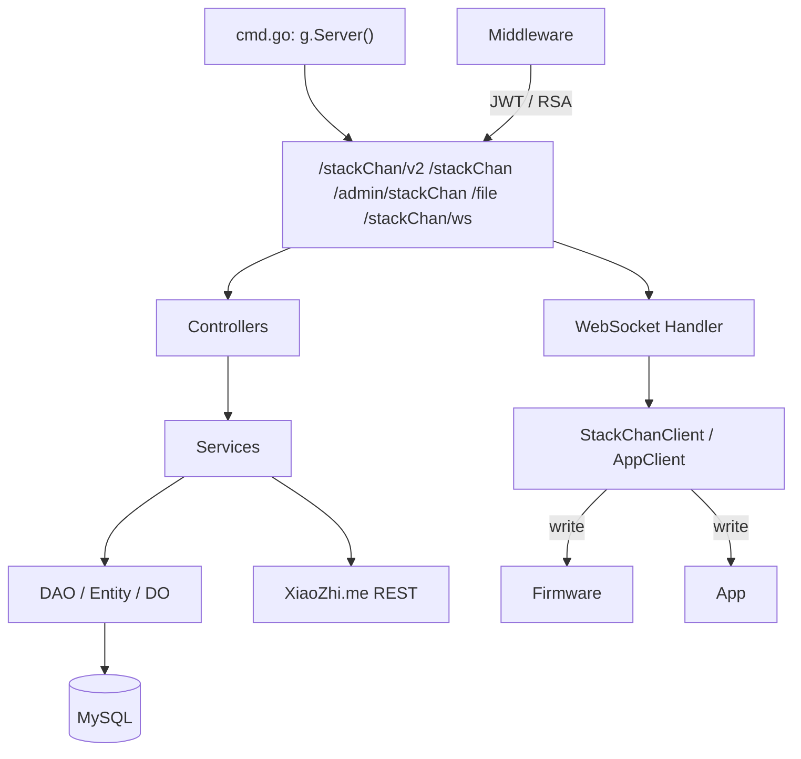
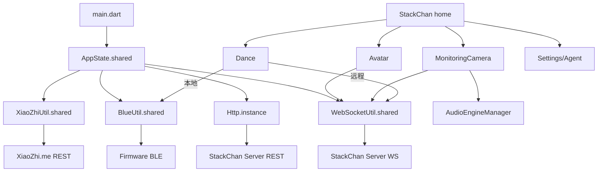
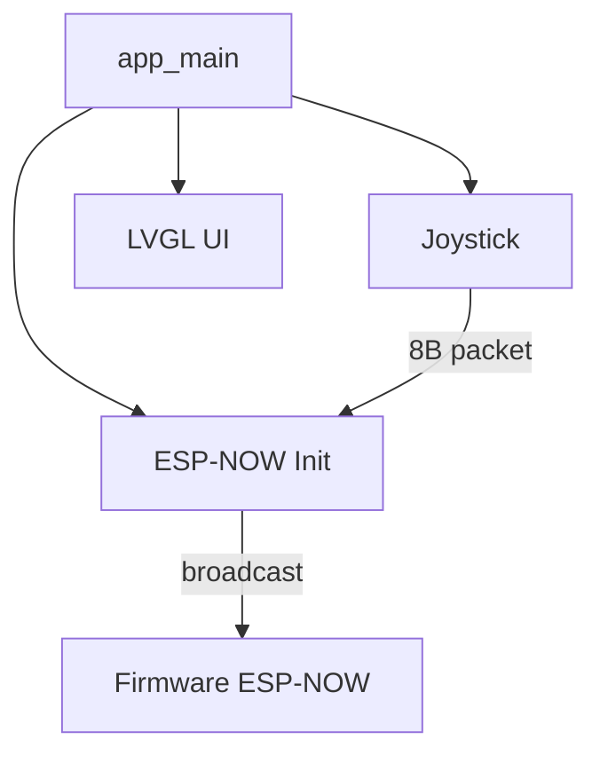

> 该文档描述历史方案、历史快照或早期探索，不代表当前实现。
> 当前方向请参考 docs/README.md 和 docs/architecture.md。

# 模块地图

按端划分，只列出对二次开发有入口意义的模块。

---

## Firmware

| 模块 | 职责 | 入口文件 | 关键类/函数 | 依赖 |
|---|---|---|---|---|
| **系统入口 / 生命周期** | 决定启动 Mooncake UI 还是 XiaoZhi AI 模式 | `firmware/main/main.cpp` | `app_main()`、`GetHAL().init()`、`GetHAL().startXiaozhi()` | HAL、Mooncake、XiaoZhi Application |
| **HAL 层** | 硬件抽象：系统、显示、音频、舵机、网络、BLE、ESP-NOW、EzData、OTA、账户 | `firmware/main/hal/hal.h`、`hal.cpp` | `Hal`、`GetHAL()`、`hal_bridge` | 板级驱动、LVGL、WiFiManager、ESP-NOW |
| **板级桥接** | 把 StackChan 硬件桥接到 XiaoZhi 的 `Board` 抽象 | `firmware/main/hal/board/hal_bridge.cc`、`stackchan.cc` | `M5StackCoreS3Board`、`StackChanAvatarDisplay` | HAL、XiaoZhi Board |
| **StackChan 核心** | Avatar、Motion、Servo、Modifier、Animation 的统一持有与更新 | `firmware/main/stackchan/stackchan.h` | `stackchan::StackChan`、`GetStackChan()` | Avatar、Motion、NeonLight、Modifiers |
| **Avatar 渲染** | 默认表情、眼睛、嘴巴、语音气泡、装饰器 | `firmware/main/stackchan/avatar/skins/default/default.cpp` | `avatar::DefaultAvatar` | LVGL、Smooth UI Toolkit |
| **Motion / Servo** | 双轴舵机控制、角度/速度、归零、堵转保护 | `firmware/main/stackchan/motion/motion.h`、`servo.cpp` | `motion::Motion`、`motion::Servo` | UART、SCSCL servo |
| **Modifiers** | 呼吸、眨眼、说话、舞蹈、头部触摸、IMU、待机动作等可组合行为 | `firmware/main/stackchan/modifiers/*.h` | `BreathModifier`、`SpeakingModifier`、`DanceModifier` 等 | StackChan Core |
| **JSON 解析** | 把 BLE/WebSocket 来的 JSON 转成 Avatar/Motion/NeonLight 更新 | `firmware/main/stackchan/json/json_helper.cpp` | `avatar::update_from_json`、`motion::update_from_json` | ArduinoJson |
| **Mooncake App Launcher** | 应用启动器、屏保、首次启动引导 | `firmware/main/apps/app_launcher/app_launcher.cpp` | `AppLauncher` | Mooncake、HAL |
| **AI Agent App** | 请求进入 XiaoZhi AI 模式 | `firmware/main/apps/app_ai_agent/app_ai_agent.cpp` | `AppAiAgent` | HAL |
| **Avatar App** | 通过 Server WebSocket 远程控制表情/动作/通话/摄像头 | `firmware/main/apps/app_avatar/app_avatar.cpp` | `AppAvatar` | WebSocketAvatar、HAL |
| **Dance App** | 通过 BLE 接收 App 点播数据并播放舞蹈 | `firmware/main/apps/app_dance/app_dance.cpp` | `AppDance` | BLE、HAL |
| **ESP-NOW Remote App** | 接收 Remote 的 ESP-NOW 动作包 | `firmware/main/apps/app_espnow_ctrl/app_espnow_ctrl.cpp` | `AppEspnowControl` | ESP-NOW、HAL |
| **Setup App** | 设置：WiFi、亮度、音量、时区、AI Agent、硬件测试、账户、OTA | `firmware/main/apps/app_setup/app_setup.cpp` | `AppSetup` 及 workers | HAL、Settings |
| **App Center** | 从 Server 拉取应用列表并下载/启动子 App | `firmware/main/apps/app_app_center/app_app_center.cpp` | `AppAppCenter` | HTTP、OTA |
| **WebSocket Avatar Service** | Firmware 与 Server/App 的 WS 连接、二进制协议收发 | `firmware/main/hal/hal_ws_avatar.cpp` | `WebSocketAvatar`、`WebsocketAvatarWorker` | Network、HAL |
| **BLE Server / 配网** | BLE GATT 服务：motion/avatar/config/rgb 写入、WiFi 配置 | `firmware/main/hal/hal_ble.cpp` | `WifiConfigServer`、`AppConfigServerWorker` | NimBLE、HAL |
| **ESP-NOW 传输** | ESP-NOW 初始化、广播/单播收发 | `firmware/main/hal/hal_espnow.cpp` | `Hal::startEspNow`、`Hal::espNowSend` | esp-now 组件 |
| **EzData** | 连接 M5Stack EzData MQTT 服务 | `firmware/main/hal/hal_ezdata.cpp` | `EzData` | MQTT |
| **账户 / OTA** | 从 Server 获取账户信息、检查/下载固件升级 | `firmware/main/hal/hal_account.cpp`、`hal_ota.cpp` | `Hal::updateAccountInfo`、`Hal::updateFirmware` | HTTP、OTA |
| **XiaoZhi 应用主循环** | AI 语音模式的事件驱动主循环 | `firmware/xiaozhi-esp32/main/application.cc` | `Application::Run`、`Application::Initialize` | AudioService、Protocol、Ota |
| **音频服务** | 麦克风采集、Opus 编解码、音频播放、唤醒词、VAD/AEC | `firmware/xiaozhi-esp32/main/audio/audio_service.cc` | `AudioService` | AudioCodec、esp-sr、opus |
| **协议层** | WebSocket / MQTT+UDP 语音通道抽象 | `firmware/xiaozhi-esp32/main/protocols/websocket_protocol.cc`、`mqtt_protocol.cc`、`protocol.h` | `Protocol`、`WebsocketProtocol`、`MqttProtocol` | Network、Opus |
| **MCP 服务器** | 注册并执行设备端 MCP 工具 | `firmware/xiaozhi-esp32/main/mcp_server.cc` | `McpServer::GetInstance()`、`AddTool` | JSON-RPC |
| **OTA / Settings** | 固件/资源升级、NVS 配置持久化 | `firmware/xiaozhi-esp32/main/ota.cc`、`settings.cc` | `Ota`、`Settings` | NVS、HTTP |

### Firmware 模块依赖简图

```mermaid
graph TD
    subgraph Mooncake Mode
        Launcher["AppLauncher"] -->|openApp| Apps["App* (AI/Avatar/Dance/ESPNOW/Setup/Center/EzData)"]
        Apps -->|GetHAL()| HAL["HAL / Board Bridge"]
        HAL -->|GetStackChan()| StackChan["StackChan Core"]
        StackChan --> Avatar["Avatar"]
        StackChan --> Motion["Motion / Servo"]
        StackChan --> Modifiers["Modifiers"]
        HAL -->|startWebSocketAvatarService| WSAvatar["WebSocketAvatar"]
        HAL -->|startBleServer| BLE["BLE / WiFiConfig"]
        HAL -->|startEspNow| ESPNOW["ESP-NOW"]
    end

    subgraph XiaoZhi AI Mode
        App["Application::Run"] --> Audio["AudioService"]
        App --> Protocol["Protocol (WS/MQTT)"]
        App --> Ota["Ota"]
        App --> Mcp["McpServer"]
        Audio -->|Opus| Protocol
        Protocol -->|JSON| Mcp
        Protocol -->|Opus| Audio
    end

    HAL --> Board["XiaoZhi Board"]
    Board --> Display["StackChanAvatarDisplay"]
    Board --> Codec["CoreS3AudioCodec"]
    Board --> Camera["StackChanCamera"]
```

---

## Server

| 模块 | 职责 | 入口文件 | 关键类/函数 | 依赖 |
|---|---|---|---|---|
| **启动 / 路由** | 启动 HTTP 服务、注册路由、WebSocket、Cron | `server/internal/cmd/cmd.go` | `cmd.Main` | GoFrame、g.Server() |
| **WebSocket 中继** | 维护设备池/App 池，按 MAC 转发二进制消息 | `server/internal/web_socket/web_socket.go` | `Handler`、`readStackChanMessage`、`readAppClientMessage`、`createMessage` | gorilla/websocket |
| **WS 客户端模型** | 连接对象与发送协程 | `server/internal/model/web_socket_model.go` | `StackChanClient`、`AppClient`、`WsSendMsg` | gorilla/websocket |
| **中间件 / 认证** | CORS、JWT、RSA MAC、Admin Token | `server/internal/middleware/middleware.go` | `TokenAuthMiddleware`、`V2TokenAuthMiddleware`、`AdminTokenAuthMiddleware` | JWT、RSA |
| **RSA 工具** | RSA 加解密、密钥加载 | `server/utility/rsa.go` | `RSADecrypt`、`RSAEncrypt` | crypto/rsa |
| **用户服务** | 注册、登录、JWT 签发、用户信息 | `server/internal/service/user.go` | `Login`、`Registration`、`GetUserInfo` | DAO User |
| **设备服务** | MAC 注册、设备名查询、绑定/解绑 | `server/internal/service/device.go`、`controller/device` | `CreateMacIfNotExists`、`GetDeviceName`、`BindDevice` | DAO Device |
| **舞蹈服务** | 舞蹈列表初始化与 CRUD | `server/internal/service/dance.go` | `GetOrCreateDanceList` | DAO DeviceDance |
| **文件服务** | 上传/下载 | `server/internal/service/file.go`、`controller/file` | `AddFile` | 本地文件系统 |
| **Agent / XiaoZhi 代理** | 从 XiaoZhi 云换 token、拉设备/Agent、恢复默认 Agent | `server/internal/xiaozhi/xiaozhi.go`、`service/agent.go` | `GetToken`、`GetDevices`、`SetAgentSetting`、`RestoreDefaultAgent` | HTTP client |
| **社区/内容** | Post、Pano、Friend、App Store | `server/internal/controller/{post,pano,friend,appstore}` | 对应 Controller | DAO |
| **定时任务** | 心跳、清理过期连接 | `server/internal/boot/cron.go` | `StartPingTime`、`CheckExpiredLinks` | GoFrame cron |
| **模型 / DAO** | 数据库实体、ORM 操作 | `server/internal/model/**/*.go`、`server/internal/dao/*.go` | `entity.*`、`do.*`、`dao.*` | GoFrame ORM |

### Server 模块依赖简图



---

## App

| 模块 | 职责 | 入口文件 | 关键类/函数 | 依赖 |
|---|---|---|---|---|
| **应用入口** | Flutter 初始化、注入全局状态 | `app/lib/main.dart` | `main()`、`runApp(App())` | GetX |
| **全局状态** | 登录、设备、WebSocket、BLE、Toast | `app/lib/app_state.dart` | `AppState.shared` | GetX、SharedPreferences |
| **HTTP 客户端** | 与 Server REST 通信 | `app/lib/network/http.dart` | `Http.instance` | Dio |
| **WebSocket** | 与 Server WebSocket 通信 | `app/lib/network/web_socket_util.dart` | `WebSocketUtil.shared` | dart:io WebSocket |
| **URL 配置** | 后端地址与 API 路径 | `app/lib/network/urls.dart` | `Urls` | - |
| **BLE 工具** | 扫描/连接/读写 GATT 特征 | `app/lib/util/blue_util.dart` | `BlueUtil.shared` | flutter_blue_plus |
| **XiaoZhi 云客户端** | Agent/设备/聊天历史/授权 | `app/lib/util/XiaoZhi_util.dart` | `XiaoZhiUtil.shared` | Dio |
| **音频引擎** | Opus 编解码、原生播放 | `app/lib/util/audio_engine_manager.dart` | `AudioEngineManager.shared` | opus_codec、NativeBridge |
| **原生桥接** | Flutter ↔ 原生（WiFi、录音、PCM 播放） | `app/lib/util/native_bridge.dart` | `NativeBridge.shared` | MethodChannel |
| **RSA 工具** | 加密认证与 BLE 握手 | `app/lib/util/rsa_util.dart` | `RsaUtil` | pointycastle |
| **主页 / 控制** | 设备选择、功能入口 | `app/lib/view/home/stack_chan.dart` | `StackChan` | AppState |
| **Avatar** | 远程表情、摄像头、屏幕镜像 | `app/lib/view/home/avatar.dart` | `Avatar` | WebSocketUtil、AppState |
| **Monitoring** | 远程摄像头 + 语音 | `app/lib/view/home/monitoring_camera.dart` | `MonitoringCamera` | WebSocketUtil、AudioEngineManager |
| **Dance** | 舞蹈列表、录制、播放 | `app/lib/view/home/dance_list_page.dart` 等 | `DanceListPage`、`RecordDance`、`Dance` | HTTP、BLE/WS |
| **聊天历史** | 展示 XiaoZhi 云对话 | `app/lib/view/home/conversation_page.dart` | `ConversationPage` | XiaoZhiUtil |
| **Agent 配置** | AI Agent 创建/编辑/绑定 | `app/lib/view/popup/agent_configuration.dart`、`edit_agent.dart` | `AgentConfiguration`、`EditAgent` | XiaoZhiUtil |
| **设备绑定** | BLE 扫描、握手、配网 | `app/lib/view/popup/binding_device.dart`、`select_blue_device.dart`、`device_wifi_config.dart` | `BindingDevice`、`SelectBlueDevice` | BlueUtil |

### App 模块依赖简图



---

## Remote

| 模块 | 职责 | 入口文件 | 关键类/函数 | 依赖 |
|---|---|---|---|---|
| **系统入口** | 初始化 M5、摇杆、LVGL、ESP-NOW | `remote/code/main/StackChan-RemoteControl-ESPNow.cpp` | `app_main()` | M5Unified |
| **ESP-NOW 初始化** | WiFi STA + ESP-NOW 信道配置 | `remote/code/main/esp_now/esp_now_init.c` | `wifi_espnow_init`、`espnow_send_data` | esp-now |
| **摇杆处理** | 读取摇杆/IMU、生成动作包、三屏 UI 任务 | `remote/code/main/joystick/joystick_handle.c` | `joystick_init`、`handle_running_screen` | I2C、ESP-NOW |
| **LVGL UI** | Setup / Running / IMU 三个屏幕 | `remote/code/main/ui/` | `ui_init`、`switch_screen` | LVGL 8 |

### Remote 模块依赖简图


